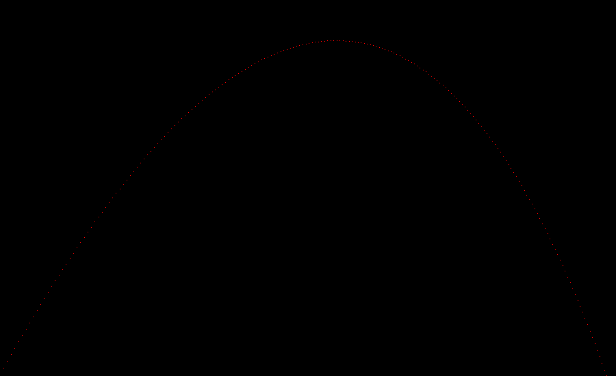
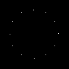
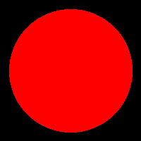
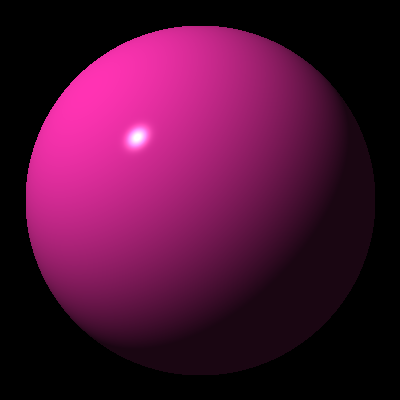

# Examples
Contains sample functionality of this library

## Vector Ballistics
Generates a .ppm image depicting an artillary strike with red pixels 
representing the projectile positions at different times.

## Clock
Generates a .ppm image of a clock with white pixels representing the different 
positions.

## Sphere
Generates a .ppm image of a red sphere on a black canvas with ray tracing.

## Shading
The same exemple as Sphere but with shading.

